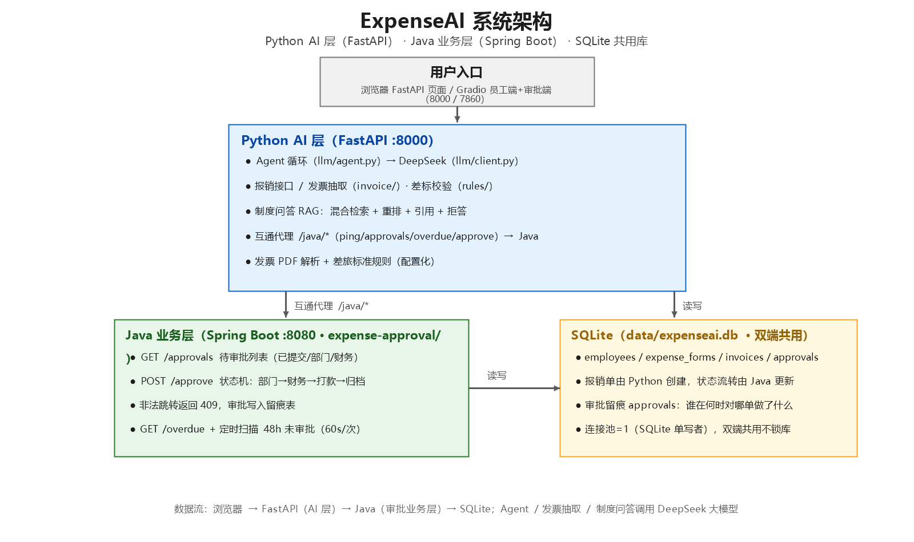

# AI-GIO（本地项目名：ExpenseAI）

> 企业差旅报销系统 + AI 制度问答助手（生产级 RAG）——四周完成：报销业务闭环 + 基础 RAG + 评测对比 + Java 审批业务层

## 项目简介（一句话）

员工提交差旅报销单、上传电子发票 → AI 自动抽取发票字段、校验差旅标准 → 多级审批（部门 → 财务）→ 打款归档；员工随时用自然语言问差旅制度，制度问答用生产级 RAG（混合检索 + 重排 + 引用 + 拒答 + 评测对比）。

## 当前进度

| 阶段 | 内容 | 状态 |
|---|---|---|
| 第 1 周（Day 1-7） | LLM 封装 → FastAPI → 手写 ReAct Agent → 网页 | ✅ |
| 第 2 周（Day 8-14） | 发票抽取 → 报销单 → 差标校验 → 基础 RAG → SQLite → 审批状态机 → Agent 接业务 | ✅ |
| 第 3 周（Day 15-21） | 切块对比 → 混合检索 → 重排/引用/拒答 → golden set → 评测对比 → Gradio 界面 → 全流程验收 | ✅ |
| 第 4 周（Day 22-28） | Java 业务层：Spring Boot 审批状态机 + 定时提醒 + 一键启动 | 🔄 进行中（Day 26 完成） |

## 功能清单

- **员工端**：上传发票 PDF 自动抽取字段（金额/日期/发票号/抬头/类型），提交报销自动差标校验（住宿分档/交通/餐补），重复发票号拦截
- **审批端**：待审批列表 + 通过/驳回，状态机流转（草稿→已提交→部门审批→财务审批→已打款→已归档），非法跳转拦截
- **制度问答**：混合检索 + LLM 重排 + 引用出处 + 相关度拒答
- **Agent 对话**：自然语言调业务工具（差标校验/报销查询/制度问答）
- **Java 审批接口（Day 23）**：GET /approvals 待审批列表 + POST /approve 状态流转，与 Python 共用 SQLite
- **超时提醒 + 互通（Day 24）**：Java 定时扫描 48h 未审批单（GET /overdue）；FastAPI 的 /java/* 代理直连 Java
- **一键启动（Day 25）**：start.bat 拉起三服务 + 端口/健康检查

## 评测数字（Day19，41 条 golden set）

| 指标 | 纯向量 | 混合+重排 |
|---|---|---|
| Recall@1 | 92.7% | **95.1%** |
| Recall@3 | 100% | 100% |
| faithfulness | - | 90~100% |
| answer relevancy | - | 90~100% |

## 技术栈

- Python 3.10 + FastAPI + uvicorn + Gradio
- OpenAI SDK（兼容 DeepSeek，base_url 外置）
- SQLite（四张表：员工/报销单/发票/审批记录）
- 手写 RAG（字符 bigram 向量 + BM25 + RRF 融合 + LLM 重排）
- Java 21 + Spring Boot 4（expense-approval/，Maven Wrapper 免装 Maven）
- 一键启动 start.bat（Day 25）

## 架构图



```
浏览器 / Gradio 界面（8000 / 7860）
            ↓
┌─────────────────── Python AI 层（FastAPI :8000）───────────────────┐
│ Agent 循环 → DeepSeek 模型                                         │
│ 报销接口 / 发票抽取 / 差标校验                                      │
│ 制度问答 RAG（混合检索+重排+引用+拒答）                             │
│ 互通代理 /java/* → Java                                           │
└────────┬───────────────────────────────────────┬──────────────────┘
         │ 互通代理 /java/*                      │ 读写
         ▼                                       ▼
┌─────────────────────┐              ┌─────────────────────┐
│ Java 业务层 :8080    │──读写──────▶│ SQLite expenseai.db  │
│ /approvals /approve  │              │ employees/forms/... │
│ /overdue 定时提醒48h │              └─────────────────────┘
└─────────────────────┘
```

## 目录结构

```
app/                 FastAPI 接口 + Gradio 界面 + 业务工具
llm/                 模型调用层 + Agent 循环 + 工具注册表
invoice/             发票 PDF 解析 + LLM 字段抽取
rules/               差旅标准规则表（配置化）
rag/                 制度问答（切块/检索/重排） + 制度文档
eval/                golden set + 评测脚本 + 对比报告
static/              FastAPI 页面
expense-approval/    Java 业务层（Spring Boot + Maven Wrapper）
docs/                日志、周记、评测报告、验收记录、架构图
start.bat            一键启动三服务（Day 25）
db.py                SQLite 数据库层
.env                 密钥配置（不入库）
```

## 环境要求

- Windows + Python 3.10（项目自带虚拟环境 `.venv`）
- Java 21（已配置 `JAVA_HOME`；首次构建自动通过 Maven Wrapper 下载 Maven）
- 网络（首次下载 Maven/Spring 依赖、调用 DeepSeek API）
- `.env` 配置：`OPENAI_API_KEY` / `OPENAI_BASE_URL` / `OPENAI_MODEL`

## 快速开始

### 一键启动（推荐，Day 25）

双击 `start.bat`，自动拉起三个服务并做健康检查：

```
FastAPI  http://127.0.0.1:8000
Gradio   http://127.0.0.1:7860
Java     http://127.0.0.1:8080/ping
```

首次启动 Java 会下载 Maven 依赖（几分钟）；若健康检查超时，等 Java 窗口出现 `Started ExpenseApprovalApplication` 后再双击一次（端口占用会自动跳过启动）。

### 分步启动

```powershell
# 1. Python 依赖（首次）
pip install -r requirements.txt

# 2. FastAPI（对话 + 报销接口 + /docs）
.venv\Scripts\uvicorn app.main:app --reload

# 3. Gradio（员工端 + 审批端）
.venv\Scripts\python.exe -m app.gradio_ui

# 4. Java 业务层（审批 + 超时提醒）
cd expense-approval
.\mvnw.cmd spring-boot:run
```

## 接口速查

FastAPI（8000）：

```
GET  /                           聊天页面
POST /chat                       Agent 对话
POST /expense_forms              创建报销单（发票号重复 409）
GET  /expense_forms              报销单列表
POST /expense_forms/{id}/transition   状态流转（submit/approve/reject/archive）
GET  /java/ping                  互通：Java 健康检查
GET  /java/approvals             互通：Java 待审批列表
GET  /java/overdue               互通：Java 超时单
POST /java/approve               互通：Java 审批
GET  /docs                       Swagger 文档
```

Java（8080）：

```
GET  /ping                       健康检查
GET  /approvals                  待审批列表（?status= 过滤）
POST /approve                    {form_id, action, comment}；非法跳转 409
GET  /overdue                    超时未审批单（?hours=48）
```

## 评测与验收

```powershell
.venv\Scripts\python.exe -m eval.check_golden_set   # 金标准质检
.venv\Scripts\python.exe -m eval.evaluate           # 评测对比（约 1-2 分钟）
```

## 常见问题

- **端口被占用**：start.bat 会自动跳过已占用端口；手动启动前可用 `netstat -ano | findstr "8080"` 排查。
- **Java 首次启动慢**：Maven Wrapper 下载依赖，属正常；后续启动 10 秒左右。
- **PowerShell 调接口传 JSON 报 400**：Windows PowerShell 5.1 会把 curl.exe 参数里的引号转义坏，改用 `Invoke-RestMethod` 或 `curl.exe --%`。
- **想恢复测试数据**：`data/expenseai.db.bak` 是 Day 23 前的备份，可直接覆盖 `data/expenseai.db`。

## 下一步（Day 27-28）

3 分钟演示视频 + 简历 bullet（带数字）→ 面试 10 问复盘 + GitHub 公开。
