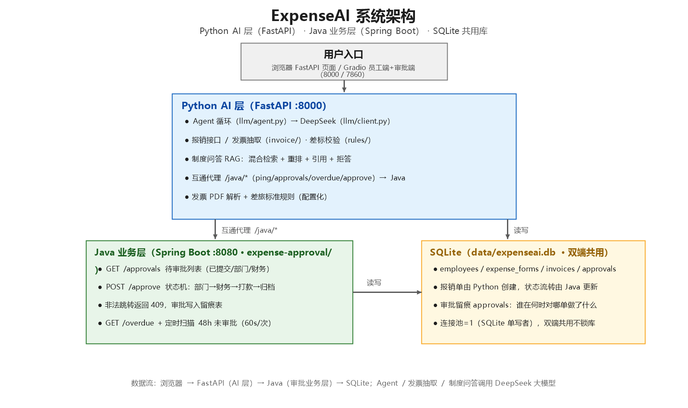

# AI-GIO（本地项目名：ExpenseAI）

**English summary**：An enterprise travel-expense system with an AI policy-QA assistant. Employees upload
invoice PDFs; the LLM extracts fields, the rules engine validates against travel standards, and a multi-level
approval flow (department → finance) runs on a Java/Spring Boot state machine. Policy questions are answered by
a hand-written, production-grade RAG pipeline — hybrid retrieval (BM25 + vector + RRF), LLM reranking over full
passages, cited answers and relevance-based refusal — measured on a 41-case golden set (Recall@1 92.7% → 95.1%).

> **时间说明**：2026.07 立项开发，2026.09 整理开源。
> 仓库不含密钥与数据库文件；`.env` 需自行配置（`OPENAI_API_KEY` / `OPENAI_BASE_URL` / `OPENAI_MODEL`）。

> 企业差旅报销系统 + AI 制度问答助手（生产级 RAG）——报销业务闭环 + 基础 RAG + 评测对比 + Java 审批业务层。

## 项目简介

员工提交差旅报销单、上传电子发票 → AI 自动抽取发票字段、校验差旅标准 → 多级审批（部门 → 财务）→ 打款归档；员工随时用自然语言问差旅制度，制度问答用生产级 RAG（混合检索 + 重排 + 引用 + 拒答 + 评测对比）。

## 功能与阶段

| 阶段 | 内容 | 状态 |
|---|---|---|
| 第一步 | LLM 封装 → FastAPI → 手写 ReAct Agent → 网页 | ✅ |
| 第二步 | 发票抽取 → 报销单 → 差标校验 → 基础 RAG → SQLite → 审批状态机 → Agent 接业务 | ✅ |
| 第三步 | 切块对比 → 混合检索 → 重排/引用/拒答 → golden set → 评测对比 → Gradio 界面 → 全流程验收 | ✅ |
| 第四步 | Java 业务层：Spring Boot 审批状态机 + 定时提醒 + 一键启动 | ✅ |
| 第五步 | 升级路线：PostgreSQL / Redis / RabbitMQ / Docker / MCP（见下文） | ✅ |

## 功能清单

- **员工端**：上传发票 PDF 自动抽取字段（金额/日期/发票号/抬头/类型），提交报销自动差标校验（住宿分档/交通/餐补），重复发票号拦截
- **审批端**：待审批列表 + 通过/驳回，状态机流转（草稿→已提交→部门审批→财务审批→已打款→已归档），非法跳转拦截
- **制度问答**：混合检索 + LLM 重排 + 引用出处 + 相关度拒答
- **Agent 对话**：自然语言调业务工具（差标校验/报销查询/制度问答）
- **Java 审批接口**：GET /approvals 待审批列表 + POST /approve 状态流转，与 Python 共用数据库
- **超时提醒 + 互通**：Java 定时扫描 48h 未审批单（GET /overdue）；FastAPI 的 /java/* 代理直连 Java
- **一键启动**：start.bat 拉起三服务 + 端口/健康检查

## 评测数字（41 条 golden set）

| 指标 | 纯向量 | 混合+重排 |
|---|---|---|
| Recall@1 | 92.7% | **95.1%** |
| Recall@3 | 100% | 100% |
| faithfulness | - | 90~100% |
| answer relevancy | - | 90~100% |

> 口径说明：41 条 golden（覆盖制度文档 17 个章节）；faithfulness / answer relevancy 为关键词与拒答行为的自动代理指标，完整报告见 `docs/eval.md` 与 `eval/chunking_report.md`。

## 技术栈

- Python 3.10 + FastAPI + uvicorn + Gradio
- OpenAI SDK（兼容 DeepSeek，base_url 外置）
- SQLite（默认本地兜底）/ PostgreSQL（生产/联调，Flyway 迁移 + 索引）
- Redis（差标规则 + 待办列表缓存，未安装时自动降级）
- RabbitMQ（审批超时提醒延迟消息，保留定时兜底）
- 手写 RAG（字符 bigram 向量 + BM25 + RRF 融合 + LLM 重排）
- Java 21 + Spring Boot 4（expense-approval/，Maven Wrapper 免装 Maven）
- 一键启动 start.bat + docker compose 一键编排

## 架构图



```
浏览器 / Gradio 界面（8000 / 7860）
            ↓
┌─────────────────── Python AI 层（FastAPI :8000）───────────────────┐
│ Agent 循环 → DeepSeek 模型                                         │
│ 报销接口 / 发票抽取 / 差标校验                                      │
│ 制度问答 RAG（混合检索+重排+引用+拒答）                             │
│ 互通代理 /java/* → Java                                           │
└────────┬───────────────────────────────────────┬──────────────────┘
         │ 互通代理 /java/*                      │ 读写
         ▼                                       ▼
┌─────────────────────┐              ┌─────────────────────────────┐
│ Java 业务层 :8080    │──读写──────▶│ PostgreSQL 16 / SQLite       │
│ /approvals /approve  │              │ employees / forms / approvals│
│ /overdue 定时提醒48h │              └─────────────────────────────┘
└─────────────────────┘        Redis 缓存 · RabbitMQ 延迟队列
```

## 目录结构

```
app/                 FastAPI 接口 + Gradio 界面 + 业务工具
llm/                 模型调用层 + Agent 循环 + 工具注册表
invoice/             发票 PDF 解析 + LLM 字段抽取
rules/               差旅标准规则表（配置化）
rag/                 制度问答（切块/检索/重排） + 制度文档
eval/                golden set + 评测脚本 + 对比报告
static/              FastAPI 页面
expense-approval/    Java 业务层（Spring Boot + Maven Wrapper）
docs/                评测报告、验收记录、架构图
start.bat            一键启动三服务
db.py                SQLite 数据库层
.env                 密钥配置（不入库）
```

## 环境要求

- Windows + Python 3.10（项目自带虚拟环境 `.venv`）
- Java 21（已配置 `JAVA_HOME`；首次构建自动通过 Maven Wrapper 下载 Maven）
- 网络（首次下载 Maven/Spring 依赖、调用 DeepSeek API）
- `.env` 配置：`OPENAI_API_KEY` / `OPENAI_BASE_URL` / `OPENAI_MODEL`
- 可选：PostgreSQL / Redis / RabbitMQ（未安装时自动降级到 SQLite / 直查 / 定时兜底）

## 快速开始

### 一键启动（推荐）

双击 `start.bat`，自动拉起三个服务并做健康检查：

```
FastAPI  http://127.0.0.1:8000
Gradio   http://127.0.0.1:7860
Java     http://127.0.0.1:8080/ping
```

首次启动 Java 会下载 Maven 依赖（几分钟）；若健康检查超时，等 Java 窗口出现 `Started ExpenseApprovalApplication` 后再双击一次（端口占用会自动跳过启动）。

### 分步启动

```powershell
# 1. Python 依赖（首次）
pip install -r requirements.txt

# 2. FastAPI（对话 + 报销接口 + /docs）
.venv\Scripts\uvicorn app.main:app --reload

# 3. Gradio（员工端 + 审批端）
.venv\Scripts\python.exe -m app.gradio_ui

# 4. Java 业务层（审批 + 超时提醒）
cd expense-approval
.\mvnw.cmd spring-boot:run
```

### 容器一键编排（PostgreSQL + Redis + RabbitMQ + 三服务）

```powershell
docker compose up -d --build
```

## 接口速查

FastAPI（8000）：

```
GET  /                           聊天页面
POST /chat                       Agent 对话
POST /expense_forms              创建报销单（发票号重复 409）
GET  /expense_forms              报销单列表
POST /expense_forms/{id}/transition   状态流转（submit/approve/reject/archive）
GET  /java/ping                  互通：Java 健康检查
GET  /java/approvals             互通：Java 待审批列表
GET  /java/overdue               互通：Java 超时单
POST /java/approve               互通：Java 审批
GET  /docs                       Swagger 文档
```

Java（8080）：

```
GET  /ping                       健康检查
GET  /approvals                  待审批列表（?status= 过滤）
POST /approve                    {form_id, action, comment}；非法跳转 409
GET  /overdue                    超时未审批单（?hours=48）
```

## 评测与验收

```powershell
.venv\Scripts\python.exe -m eval.check_golden_set   # 金标准质检
.venv\Scripts\python.exe -m eval.evaluate           # 评测对比（约 1-2 分钟）
```

## 踩坑记录（现象 → 根因 → 修复）

1. **重排为省 token 截断片段，反而把召回做坏了**：早期把候选片段截断到 120 字再交给 LLM 重排，实测丢掉「其他城市住宿 300 元」这类关键约束。根因是重排依赖完整上下文判断相关性，截断后模型只能看半句制度。修复是改回完整片段重排，Recall@1 才从 92.7% 提升到 95.1%。
2. **模型凭记忆编造年份**：问「纽约现在几点」，模型答出「2025 年」的时间幻觉。根因是概率模型对实时/外部事实没有权威来源，提示词约束不可靠。修复是关键词检测 + 强制调用 `get_time` 工具的程序兜底：概率输出的边界必须用确定性代码钉住。
3. **RabbitMQ 延迟消息的队头阻塞**：单队列 TTL + 死信方案下，一条 48h 延迟消息会把后面所有短延迟消息堵住。修复是消费端按审批状态幂等 + `@Scheduled` 定时扫描兜底，MQ 不可用时业务不中断。
4. **发票号重复提交的并发窗口**：只靠应用层「先查再写」在并发下会双写。修复是应用层查重 + 数据库 UNIQUE 约束双保险，冲突统一返回 409。
5. **误把数据库备份和缓存提交进仓库**：`data/*.db.bak`、`__pycache__/*.pyc` 一度进过版本库。修复是逐个清理并补 `.gitignore`，现在仓库里没有任何数据库、备份或缓存文件。
6. **PowerShell 5.1 调接口传 JSON 报 400**：Windows PowerShell 会把 `curl.exe` 参数里的引号转义坏。修复是改用 `Invoke-RestMethod` 或 `curl.exe --%`。

## 常见问题

- **端口被占用**：start.bat 会自动跳过已占用端口；手动启动前可用 `netstat -ano | findstr "8080"` 排查。
- **Java 首次启动慢**：Maven Wrapper 下载依赖，属正常；后续启动 10 秒左右。
- **想恢复测试数据**：`data/expenseai.db.bak` 是开发期备份（不入库），可直接覆盖 `data/expenseai.db`。

## 后续计划

- 评测进 CI：golden set 与检索指标接入 GitHub Actions，指标劣化即 fail
- 三方检索对比：手写 numpy 向量 vs pgvector（可选 LightRAG 图检索），出 Recall@k / NDCG@k 与延迟对比
- 演示视频与在线 Demo

---

## 升级路线落地

> 目标：从「AI 应用项目」升级为「能工程化落地的 AI 后端项目」——
> SQLite 单机 → PostgreSQL + Redis + RabbitMQ + Docker，同时保留手写 RAG/Agent 差异化。

### 升级1：SQLite → PostgreSQL（数据层企业化）

- 数据层按 `DB_BACKEND` 切换：`sqlite`（默认，本地照旧） / `postgres`（psycopg2 + 连接池，上限 10）
- Java 端默认走 PostgreSQL，Flyway 自动执行 `expense-approval/src/main/resources/db/migration/`
  （V1 建表 + V2 索引：approvals(expense_form_id)、approvals(created_at)、expense_forms(status)）
- 本机没装 PG 时 Java 可临时用 sqlite 兜底：`.\mvnw.cmd spring-boot:run --spring.profiles.active=sqlite`
- 存量数据搬迁：`.venv\Scripts\python.exe scripts\export_sqlite_to_postgres.py`

### 升级2：Redis 缓存（性能层）

- 差标规则启动预热进 Redis（`rules/travel_rules.py`），校验接口 cache-aside；发版变更调 `invalidate_rules_cache()`
- 审批待办 `/java/approvals`、超时 `/java/overdue` 缓存 30s，任何审批写入（通过/驳回/流转）主动删 key
- 运维端点：`POST /admin/cache/invalidate` 一键失效全部业务缓存
- Redis 不可用自动降级为直查，业务不中断

### 升级3：审批超时提醒 → RabbitMQ 延迟消息（工程亮点）

- 进入待审批状态（已提交/部门审批/财务审批）时发送 48h 延迟消息（单条 TTL + 死信队列）
- 消费端按状态幂等处理：仍待审批→告警，已审批/驳回/不存在→忽略
- Python 与 Java 双侧发布（`mq.py` / `OverdueMessageProducer`），重复消息消费端幂等去重
- `OverdueTask` 定时扫描保留为兜底，防消息丢失；Rabbit 不可用时自动降级

### 升级4：Docker 容器化 + 一键编排（部署层）

- 三服务各一个 Dockerfile（Java 多阶段构建，运行镜像只带 jar）
- `docker compose up -d --build` 一键起 PostgreSQL + Redis + RabbitMQ + 三服务
- `.env` 不入镜像（密钥由 compose 环境变量注入）；`start.bat` 本地入口保留

### 升级5：MCP / Function Calling

- `llm/tools.py` 提供 OpenAI function-calling 原生 schema（`TOOL_SCHEMAS` / `business_tool_schemas()`）
- `mcp_server.py` 用 FastMCP 把报销/差标/问答三个业务工具暴露为标准 MCP server：
  `.venv\Scripts\python.exe -m mcp_server`（默认 stdio；装好 `pip install fastmcp` 后使用）

### 新增依赖

```text
psycopg2-binary   # 升级1
redis             # 升级2
pika              # 升级3
fastmcp           # 升级5（可选）
```

## License

MIT © 2026 Kewei Wang，详见 [LICENSE](LICENSE)。
